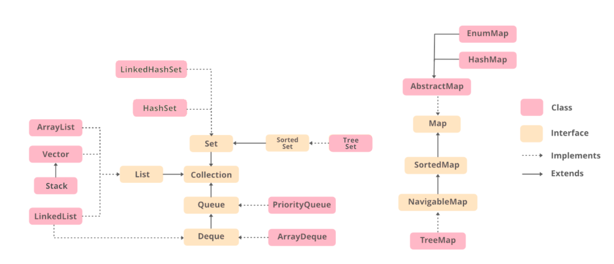

# Collections or Data Structures

# Collections

## Stack
- Synchronized because it extends Vector
- LIFO Data structure
- We can implement it using array or linked list
- Initial capacity zero
- Big O Analysis
  - nth element
  - adding and removing - constant time  

  